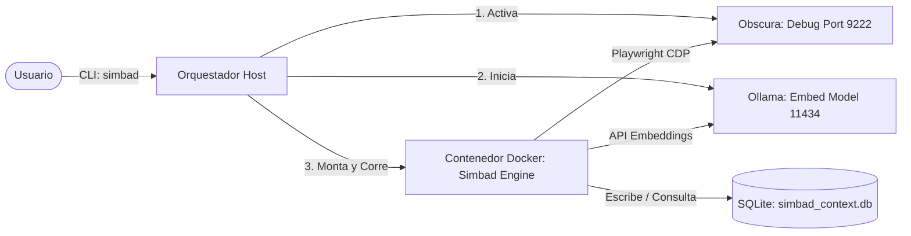

# ⛵ MCP_SIMBAD

Simbad es un motor de navegación, scraping y automatización web sigiloso diseñado para ser ultra eficiente en tokens e integrarse como servidor **MCP (Model Context Protocol)** en herramientas de Inteligencia Artificial (IDEs, CLI, etc.).

Funciona interactuando de forma híbrida (simulación humana a nivel de DOM y teclado Playwright nativo) con navegadores abiertos con puertos de depuración activa, garantizando que tu cursor y foco del sistema permanezcan intactos.

## 🧠 The Ocean Brain Architecture

Simbad utilizes two powerful engines running entirely in **Headless Mode** (sin interfaz gráfica) to avoid interrupting your workflow:
1. **Agile Engine (Obscura - Port 9222):** A lightweight Rust-based headless browser used for stealth web scraping and research.
2. **Heavy Engine (Chromium Headless - Port 9227):** A persistent Chromium instance (perfil aislado, no tu Chrome personal) para WhatsApp Web.

### 📱 Escaneando el QR de WhatsApp (Headless)
Si WhatsApp requiere reconexión, el comando `whatsapp` en el prompt `simbad>` captura el QR desde Chromium y lo renderiza como ASCII directamente en la terminal. Escanea el código con tu teléfono desde WhatsApp → Menú → WhatsApp Web.

---

## 🚀 Características Principales

* **Interacción Híbrida Sigilosa:** Envía mensajes en WhatsApp Web y ChatGPT sin activar las ventanas ni secuestrar el puntero del mouse del host (ideal para entornos con gestores de ventanas como Hyprland).
* **Eficiencia de Tokens Extrema (`--site read`):** Extrae páginas web y limpia el DOM eliminando scripts, estilos, cabeceras, pies de página, barras laterales y publicidad, reduciendo el consumo de tokens en un **90%**.
* **Caché Semántica Local (Smart Query):** Guarda los historiales de navegación y búsquedas vectorizados en una base de datos SQLite efímera, permitiendo responder consultas localmente (usando modelos de Ollama) sin consumir internet ni tokens de APIs.
* **Base de Datos Efímera por Sesión:** La base de datos vectorial se inicializa al encender y se purga al 100% al apagar para garantizar privacidad absoluta y 0 bytes ocupados en disco.
* **Instalador Autogestionado:** Configura todo el entorno de forma portable en cualquier máquina Linux con un solo comando.

---

## 🛠️ Requisitos del Sistema

* **Docker**
* **Ollama** (para la generación local de embeddings con `nomic-embed-text`)
* Chromium instalado en el sistema
  ```bash
  chromium --remote-debugging-port=9222
  ```

---

## 📦 Instalación

Para instalar o portar Simbad a cualquier máquina Linux:

1. Clona este repositorio.
2. Entra en el directorio del proyecto y corre el instalador:
   ```bash
   cd MCP_SIMBAD/
   ./install.sh
   ```

El instalador verificará las dependencias, compilará la imagen Docker y creará un enlace simbólico en tu terminal para que puedas llamar a `simbad` de forma global.

---

## 🧭 Guía de Uso

Simbad cuenta con varios modos de navegación y consulta:

### 1. Consulta Inteligente (Modo por Defecto)
Resuelve preguntas conceptuales. Busca en la memoria semántica local primero (usando Ollama); si no tiene el contexto, consulta a ChatGPT, te da la respuesta y la indexa localmente:
```bash
simbad "Tu pregunta o instrucción"
```

### 2. Extracción Limpia de Páginas Web
Navega a una URL, limpia el código fuente y extrae el texto puro y libre de basura:
```bash
simbad --site read "https://news.ycombinator.com"
```

### 3. Búsqueda Web Estructurada
Busca en DuckDuckGo y devuelve títulos, fragmentos y enlaces ligeros:
```bash
simbad --site search "clima actual en Santiago de Chile"
```

### 4. Búsqueda Semántica Local
Busca conceptos en toda la base de datos de tu sesión actual usando similitud de coseno vectorial:
```bash
simbad --site semsearch "conceptos clave sobre automatización"
```

### 5. WhatsApp Web
Envía mensajes de forma sigilosa sin interrumpir tu navegación diaria:
```bash
simbad --site whatsapp "Yesica Acuña" "Mensaje de prueba automático de Simbad"
```

---

## 🏛️ Arquitectura del Entorno



---

## 📂 Estructura del Proyecto

* **`simbad`**: Shell script orquestador y lanzador.
* **`sync_memories.py`**: Sincroniza historial de CLIs (OpenCode, Claude Code, Antigravity) en la base Pacífico.
* **`simbad_mcp.py`**: Adaptador para exponer a Simbad como servidor MCP (Model Context Protocol).
* **`Dockerfile`**: Definición del contenedor de ejecución aislado.
* **`install.sh`**: Script instalador autogestionado.
* **`db/`**: Carpeta temporal montada donde reside la base de datos de la sesión.

---

## 📞 Soporte y Contacto

Si tienes preguntas, sugerencias o necesitas soporte con Simbad, puedes contactar al desarrollador:

* **GitHub:** [alnarva](https://github.com/alnarva)
* **Correo Electrónico:** alfredo.narvaez.pinedo@gmail.com

